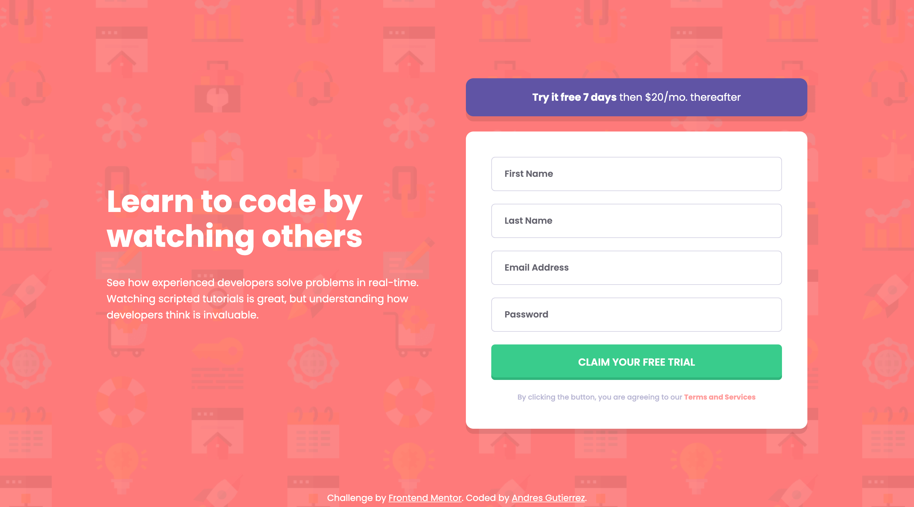

# Frontend Mentor - Intro component with sign up form solution

This is a solution to the [Intro component with sign up form challenge on Frontend Mentor](https://www.frontendmentor.io/challenges/intro-component-with-signup-form-5cf91bd49edda32581d28fd1). Frontend Mentor challenges help you improve your coding skills by building realistic projects.

## Table of contents

- [Frontend Mentor - Intro component with sign up form solution](#frontend-mentor---intro-component-with-sign-up-form-solution)
  - [Table of contents](#table-of-contents)
  - [Overview](#overview)
    - [The challenge](#the-challenge)
    - [Screenshot](#screenshot)
    - [Links](#links)
    - [Built with](#built-with)
    - [Continued development](#continued-development)
    - [Useful resources](#useful-resources)
  - [Author](#author)
  - [Table of contents](#table-of-contents-1)
  - [Overview](#overview-1)
    - [The challenge](#the-challenge-1)
    - [Screenshot](#screenshot-1)
    - [Links](#links-1)
    - [Built with](#built-with-1)
    - [Continued development](#continued-development-1)
    - [Useful resources](#useful-resources-1)
  - [Author](#author-1)

## Overview

### The challenge

- Use of TailwindCSS
- Configura TailwindCSS with the project style-guide
- Use AlpineJS to add the interativity on the component

Users should be able to:

- View the optimal layout depending on their device's screen size

### Screenshot

### Links

- Solution URL: [Add solution URL here](https://github.com/AGutierrezR/intro-component-with-signup-form/tree/tailwind)
- Live Site URL: [Add live site URL here](https://merry-douhua-2ac6be.netlify.app/)

### Built with

- Semantic HTML5 markup
- [Tailwind CSS](https://tailwindcss.com/)
- [Alpine.js](https://alpinejs.dev/)
- Mobile-first workflow

### Continued development

- Screenreader only text

### Useful resources

- [Tailwind Docs](https://tailwindcss.com/docs/configuration) - Tailwind CSS Documentation.
- [Alpine.js Docs](https://alpinejs.dev/start-here) - Alpine.js Documentation.

## Author

- Website - [Andres Gutierrez](https://agutierrezr.github.io/)
- Frontend Mentor - [@AGutierrezR](https://www.frontendmentor.io/profile/AGutierrezR)
- Twitter - [@AGutierrezr_](https://twitter.com/AGutierrezr_)

## Table of contents

- [Frontend Mentor - Intro component with sign up form solution](#frontend-mentor---intro-component-with-sign-up-form-solution)
  - [Table of contents](#table-of-contents)
  - [Overview](#overview)
    - [The challenge](#the-challenge)
    - [Screenshot](#screenshot)
    - [Links](#links)
    - [Built with](#built-with)
    - [Continued development](#continued-development)
    - [Useful resources](#useful-resources)
  - [Author](#author)
  - [Table of contents](#table-of-contents-1)
  - [Overview](#overview-1)
    - [The challenge](#the-challenge-1)
    - [Screenshot](#screenshot-1)
    - [Links](#links-1)
    - [Built with](#built-with-1)
    - [Continued development](#continued-development-1)
    - [Useful resources](#useful-resources-1)
  - [Author](#author-1)

## Overview

### The challenge

- Use of TailwindCSS
- Configura TailwindCSS with the project style-guide

Users should be able to:

- View the optimal layout depending on their device's screen size

### Screenshot

### Links

- Solution URL: [Add solution URL here](https://github.com/AGutierrezR/results-summary-component/tree/tailwind)
- Live Site URL: [Add live site URL here](https://friendly-selkie-2a41ac.netlify.app/)

### Built with

- Semantic HTML5 markup
- [Tailwind CSS](https://tailwindcss.com/)
- Mobile-first workflow

### Continued development

- Screenreader only text

### Useful resources

- [Tailwind Docs](https://tailwindcss.com/docs/configuration) - Tailwind CSS Documentation.

## Author

- Website - [Andres Gutierrez](https://agutierrezr.github.io/)
- Frontend Mentor - [@AGutierrezR](https://www.frontendmentor.io/profile/AGutierrezR)
- Twitter - [@AGutierrezr_](https://twitter.com/AGutierrezr_)

